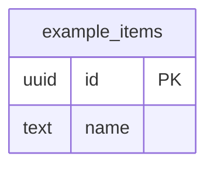

# __NAME__ · __TYPE__

| 항목 | 값 |
|---|---|
| slug | `__SLUG__` |
| 유형 | `__TYPE__` |

## ER 다이어그램

```mermaid
erDiagram
  example_items {
    uuid id PK
    text name
  }
```

## 접근 규칙

- TODO: 누가 무엇을 읽고 쓸 수 있는지 적으세요.

> 이 문서는 제안 초안입니다.
