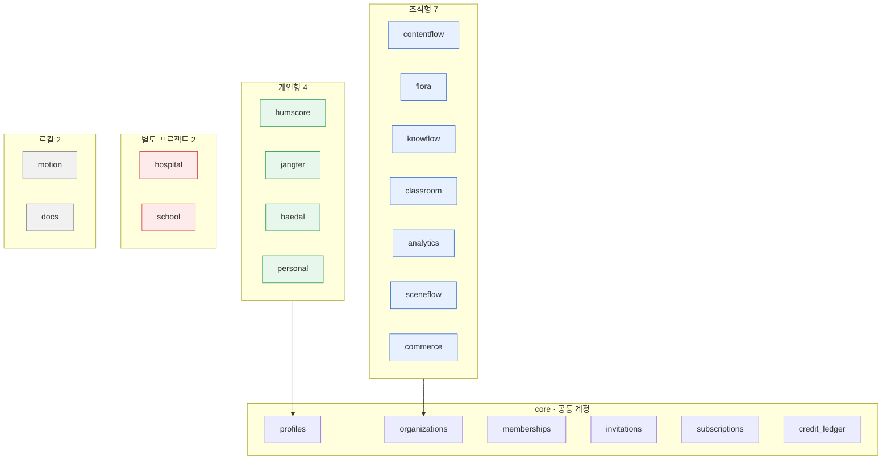

# 전체 구조도

```mermaid
flowchart TB
  subgraph CORE[core · 공통 계정]
    prof[profiles]
    org[organizations]
    mem[memberships]
    inv[invitations]
    sub[subscriptions]
    led[credit_ledger]
  end
  subgraph ORGS[조직형 7]
    cf[contentflow]:::o
    fl[flora]:::o
    kf[knowflow]:::o
    cr[classroom]:::o
    an[analytics]:::o
    sc[sceneflow]:::o
    cm[commerce]:::o
  end
  subgraph USRS[개인형 4]
    hs[humscore]:::u
    jt[jangter]:::u
    bd[baedal]:::u
    ps[personal]:::u
  end
  subgraph ISO[별도 프로젝트 2]
    hp[hospital]:::s
    sh[school]:::s
  end
  subgraph LOC[로컬 2]
    mo[motion]:::l
    dc[docs]:::l
  end
  ORGS --> org
  USRS --> prof
  classDef o fill:#e6f0ff,stroke:#3b6fd4
  classDef u fill:#e8f7ec,stroke:#2f9e5a
  classDef s fill:#fdeaea,stroke:#d44
  classDef l fill:#f1f1f1,stroke:#888
```
