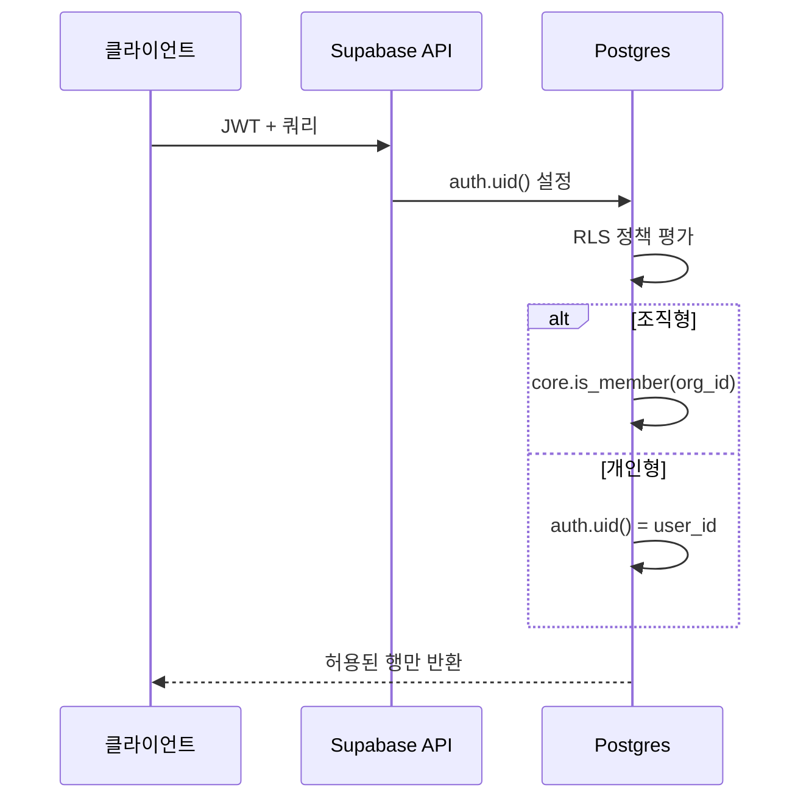

# RLS 판단 흐름

```mermaid
sequenceDiagram
  participant C as 클라이언트
  participant API as Supabase API
  participant DB as Postgres
  C->>API: JWT + 쿼리
  API->>DB: auth.uid() 설정
  DB->>DB: RLS 정책 평가
  alt 조직형
    DB->>DB: core.is_member(org_id)
  else 개인형
    DB->>DB: auth.uid() = user_id
  end
  DB-->>C: 허용된 행만 반환
```
